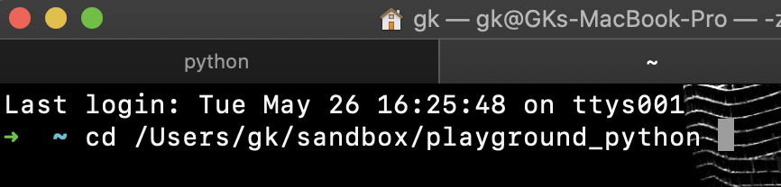
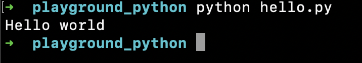

# Running Python code

---

    
2 ways to run Python codelists

        <iframe src="https://www.youtube.com/embed/wiwBzYVR2uo?rel=0" frameborder="0" allow="accelerometer; autoplay; encrypted-media; gyroscope; picture-in-picture" allowfullscreen ></iframe>

---

In the Terminal run `python` so you will start python environment and see a command prompt like this:

`>>>`

Now let's run our first command `print('Hello world')` and hit Enter. 

The output will be our 'Hello world' phrase and that's it, we've just executed our first Python code with `print` method which is use to output something in the terminal console. 

---

Another way is to create a file with .py extension and execute it. Let's do it.

But before we want you to create a folder for this course and go into this folder from the terminal. To do that you can type `cd  ` -- cd and a space -- and then drag and drop your folder into the terminal so you will see something like this:

Now inside this folder create a new file either in your code editor or from the Terminal with `touch hello.py`

Open up this file and put `print('Hello world')` into it. Save it and from the terminal run with 

`python hello.py`

Yay! 🙌

