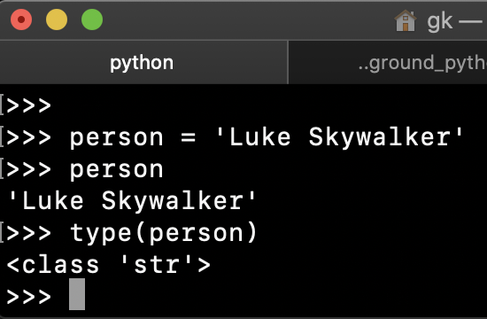
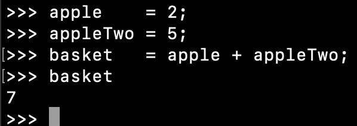

# Variables, print(), comparison, modulus operator


A variable is a storage location paired with an associated symbolic name (an identifier), which contains some known or unknown quantity of information referred to as values.

In other words a variable is a container for some data and this data is often unknown for us but we always know what type of data we expect. 

In Python to declare a variable we only need to provide a name for it, assignment operator `=` and a value like this:

`person = 'Luke Skywalker'`

>To test all of these snippets you should use Python runtime environment in your terminal. Run `python` there to see a command prompt with `>>>`. To go through the history of all the code you executed in the console simply press Up or Down arrows on your keyboard.

We can now print back the value of this variable by simply typing it's name and hitting Enter:



And also check data type by running `type(person)`

Now we can change the value at any moment with `person = 'Darth Vader'` -- no problem at all! 

The content of variables can be changed at any moment, you can think of them as placeholders for your data.

If we do `person = 100` now the data type is different, it will be `int` now. 

---

### Naming variables

A variable name must start with a letter or the underscore character, can not start with a number. It can only contain alpha-numeric characters and underscores and they are case-sensitive. It's a good practice to give variable a meaningful name, like `surname = "Skywalker"` is always better than `foo = 'Skywalker'`


Acceptable variable names in terms of syntax:
```python
fullname = "Boba Fett"
full_name = "Boba Fett"
_full_name = "Boba Fett"
FullName = "Boba Fett"
FULLNAME = "Boba Fett"
fullname2 = "Boba Fett"
```

Unacceptable:
```python
2fullname = "Boba Fett"
full-name = "Boba Fett"
full name = "Boba Fett"
```

Conventionally we try to use lowercase_with_underscore between words for naming of variables, CAPITAL_SNAKE_CASE for constants and UpperCamelCase for classes. Variables with double underscores before and after, so called dunders, are supposed to be private variables `__like_this__`

---

## Doing math

With numbers we can use variables for mathematical operations, a bit like in algebra.

So if you have a variable called `apple` that holds a value of 2 and another variable called `apple_two` that holds a value of 5, you could sum them up, and for example assign their sum to a third variable called `basket` that holds their sum:

```python
apple = 2;
apple_two = 5;
basket = apple + apple_two;
```

Now basket will have a value of 7:



Another example:

```python
rent = 800 
shopping = 120 
restaurant = 33 
total_expenses = rent + shopping + restaurant 
```

In the same way you may also subtract variables:

```python
gift = 300 
remaining_money = total_expenses - gift 
```

Of course we can do all the match operation with our numbers and the math operators in Python are:

```
+ addition, 2 + 2 will give back 4
- subtraction, 2 - 2 will give back 0
* multiplication, 2 * 2 will give back 4
/ division, 2 / 2 will give back 1 
** exponentation, 2 ** 3 will give 8
% modulus, returns remainder after division, 10 % 3 will give 1 
// integer division, return division results without decimals, 10 // 3 will give 3
```

> While performing math it is often needed to round the results, in this case a built-in method `round()` would be very handy! 

And with math we can reassign values of variables after performing calculations. Let's say we have post on twitter and want to count number of likes. Initially we will have `likes = 0`, once someone liked out tweet we will do `likes = likes + 1` which is a very common concept in programming meaning new value is a current value plus something. And now value of `likes` is 1. And then another like coming up and we do it again with `likes+=1` which is doing the same thing but with shorter syntax. 

In the same way we can use other math operators: `likes*=10` will multiply current value of likes by ten and save results as a new value of likes. 

Be careful with doing math on your numbers since the results can change the data type of your variables:

```python
num = 1
type(num)
# <class 'int'>
num
# 0.3333333333333333
num = num / 3
type(num)
# <class 'float'>
```

We can bring back our `num` to data type `int` with `int()` built-in function like this: `int(num)`. Same way we can change data type of any variables with built-in functions `float()`, `str()`, etc.

---

## print()

`print` is one of the simplest Python methods, the only thing it does is printing out whatever we pass to it as an argument.

In order to execute any Python method  we need to write:

- the name of the method: `print`
- open and close parentheses: `()`

So writing `print()` this way would be a perfectly valid way to call the `print` method.

However as the purpose of `print` is to print out data, it will achieve nothing if we do not pass some data to it.

So to make our `print` work, let’s pass an argument. An argument is what goes inside the parentheses, it could be a number, a string, a variable or anything else.

Let’s print out the value of a variable called `age`.

```python
age = 23
print(age)
```

We can print multiple items at once and in order to do that we can separate them with a comma:

```python
name = "Luke"
surname = "Skywalker"
print(name, surname)
```

`print` is super handy when we want to check our code during execution, to see what are the current values of some variables we are using, so it's a first step towards debugging. 


The values we can assign to variables are not limited to numbers, they could also be strings.

A string in Python stores a series of characters like `"Luke Skywalker"`.

A string can be any text inside *double* or *single* straight quotes. So **string** in Python simply put is just a text.

For example `"Luke Skywalker"` and `'Luke Skywalker'` are equivalent.

However please note that you have to be consistent in the quotes you use, for instance 
`"Luke Skywalker'` would throw you an error because you started with double and ended with single quotes.

You can combine strings to each other in what is called *string concatenation*:

```python
name = "Luke"
surname = "Skywalker"
fullname = name + surname
```

However keep in mind that if you want space in between words you need to add that yourself.

You can either do that by adding an extra space at the end of the string.

    name = "Luke "

Or you can add it in the concatenation

    fullname = name + " " + surname

More examples:

```python
greeting = 'hello ' 
name = 'Luke ' 
question = 'how are you today?' 
print(greeting+name+question) 
```

The good thing about using variables instead of hardcoded names is that if the name changes you can keep everything else as it is and still get the correct name printed out:
 `name = 'Han '` 

    print(greeting+name+question) 

And we can also re-assign values for the variables we used. Note that the type of value could be different from the previous one:

```python
name = 100;
```
and
```python
foo = 10
foo = "string"
foo = True
foo = ['a','b','c']
foo = {'name':'Luke','surname':'Skywalker'}
```

As you can see every time we assign new value of different data type to the foo variable it’s own data type changes!

This happens because Python is a weakly typed language. It uses dynamic typing, meaning that type of variable is defined by it's value. So what was *string* before could easily become a *number* or *boolean* if we will re-assign corresponding new values to it.

---

## Comparison operators

The comparison operators are used to compare two or more values to each other.

You can compare for example if a number is greater than another one or if the type of a value is equal to the type of another.

Let’s do a few comparison to understand the operators. 

Is 5 bigger than 10?

     5 > 10

Is 100 smaller than 200?

    100 < 200

Is `foo` bigger than `bar` which is bigger or equal to 1?

    foo = 10
    bar = 5
    foo > bar >= 1

Is the type of “12” equal to the typeof 12? 

    type("12") == type(12)

These comparison will return true or false according to the question asked. 

---

### Comparison operators list:

```python
!= not equal
== equal
< less than
> more than
>= more than or equal
<= less than or equal
```

There is also `is` operator which checks whether both the operands refer to the same object or not compared to `==` compares the values of both the operands and checks for value equality:

```python
foo = [1,2,3]
bar = [1,2,3]
foo == bar
# True
foo is bar
# False
xxx = bar 
xxx is bar
# True
xxx
# [1, 2, 3]
xxx is foo
# False
xxx == foo
# True
```

If we want to compare something with more than one value, let's say we have an age range between 10 and 20, we can do it in a single statemnt:
```python
age = 15
10 < age < 20
# True

age = 30
10 < age < 20
# False
```

---

## Truthy/falsy values 

Sometimes we do not care about the exact data in a variable but we need to know if it is falsy or truthy, in other words we want to know if there is some actual data or not. In programming for that exists a concept of truthy/falsy values. Generrally speaking falsy value is almost always absence of data or explicitly flasy value. In python these are considered to be falsy:

```python
None
False
# zero of any numeric type, for example, 0, 0L, 0.0, 0j.
# any empty sequence, for example, '', (), [], {}.
# any empty mapping, for example, {}.
```
Everything else is considered to be truthy. 

To check if the value is truthy we can use `bool()` method:

```python
>>> bool(10)
True
>>> bool(0)
False
>>> bool([])
False
>>> bool({})
False
>>> bool(None)
False
>>> bool(True)
True
>>> bool('banana')
True
```


## Modulus operator

Divides the value of a numeric expression by the value of another numeric expression, and produces the remainder.

```python
10 % 2
#remainder would be 0  since  2 can stay 5 times inside 10 with no remainder

10 % 3
#remainder would be 1 since 3 can stay 3 times inside 10 with 1 left as the remainder

15 % 4
#remainder would be 3 since 4 can stay 3 times inside 15 and 3 is left as the remainder

120 % 32 
#remainder would be 24 since 32 can stay 3 times in 120 leaving 24 as remainder
```

Although the above examples may seem not to be useful, in real life they actually are.

>The most common use for the modulus operator is to check if a number is even or odd. An even number is an integer which is "evenly divisible" by two. ... Zero is an even number because zero divided by two equals zero.

So to check if a number is even all we need to do is using the modulus operator and the number 2 make sure that the remainder is 0.

- if the reminder is 0 the number is even, 
- otherwise is odd

```python
num = 100;
print(num % 2 == 0)
num = 80
print(num % 2 == 0)
num = 99
print(num % 2 == 0)
```

---

## Commenting out code

If you want to comment out some code in Python you can use "#" character:

```python
rent = 800 
shopping = 120 
restaurant = 33 
total_expenses = rent + shopping + restaurant # our total expenses
```

To comment out a block of code you can use 3 double or single quotes to open a block of comment and 3 double or single quotes to close it like that:

```python
num = 100;
print(num % 2 == 0)
'''
here we have comments
'''
num = 80
print(num % 2 == 0)
"""
another block of comments
"""
num = 99
print(num % 2 == 0)

```


<!--     
## Exercises

01. Declare variable called fruit with a value of banana and type `str`

02. Declare a variable called num1 with a value of 100 and type of `int`

03. Declare a variable called fullname with a value of Boba Fett and type `str`

04. Declare a variable called myAge with a value of 35 and type `str`

05. Declare variables my_expenses with value of 1200 and my_son_expenses with value of 350 and total_expenses with sum of these two variables -->


