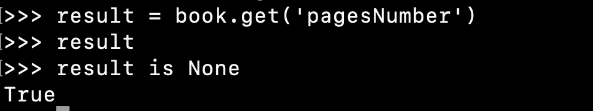
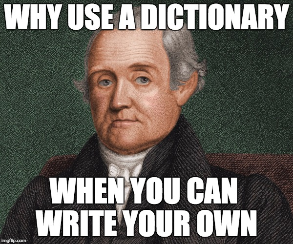

# Dictionaries


Dictionary is a collection of properties defined by a key/value pair

**Defining an empty dictionary**

```python
my_first_dict = {}
```

Think of a dictionary as container for several named pieces of information, for example the a book or a movie would fit very well inside a dictionary.

```python
book = {
'author': 'Stephen King',
'cover_artist': 'Bob Giusti',
'title': 'It',
'year': 1986,
'publisher': 'Vikings'
}
```

---

## Syntax to set or retrieve dictionaries properties

To get a value from a dictionary we use square brackets with the name of the key inside. If it is a literal name of the key we put it inside single or double quotes, without quoptes it will be treated as avariable:

```python
book = {
'author': 'Stephen King',
'cover_artist': 'Bob Giusti',
'title': 'It',
'year': 1986,
'publisher': 'Vikings'
}

print(book["author"])
print(book["cover_artist"])
print(book["title"])
print(book["year"])
print(book["publisher"])

# Stephen King
# Bob Giusti
# It
# 1986
# Vikings
```

And with variables used as a key it will be without quotation marks:

```python
book = {
'author': 'Stephen King',
'cover_artist': 'Bob Giusti',
'title': 'It',
'year': 1986,
'publisher': 'Vikings'
}

key_name = 'author'
print(book[key_name])

# Stephen King
```

> If you need to check if some key exist in the dictionary, you can use `keyName in dictName`. It will return `true` or `false`, like `"author" in book`.

> If you need to check if some value exists in the dictionary, you can use `someValue in dictName.values()`. It will return `true` or `false`, like `"Vikings" in book`.

To add or change a value in the dictionary we can assign a new value to some specific key inside the dictionary:

```python
book = {
'author': 'Stephen King',
'cover_artist': 'Bob Giusti',
'title': 'It',
'year': 1986,
'publisher': 'Vikings'
}

book['number_of_pages'] = 500
print(book)

# {'author': 'Stephen King', 'cover_artist': 'Bob Giusti', 'title': 'It', 'year': 1986, 'publisher': 'Vikings', 'number_of_pages': 500}
```

It will add a key into a dictionay or modify the current value if key already exists.

We can also compose dictionaries with `dict()` function where we pass kays and values with an equl sign:

```python
user1 = dict(name='Darth', last_name='Vader')

print(user1)

# {'name': 'Darth', 'last_name': 'Vader'}
```

---

## Looping through dictionaries

Let's print out all the data from our book dictionary. We can use `for` loop there the variable iterator will become a key of the dictionary, one by one, and by using it inside square brackets we can get teh value as well :

```python
book = {
'author': 'Stephen King',
'cover_artist': 'Bob Giusti',
'title': 'It',
'year': 1986,
'publisher': 'Vikings'
}

for key in book:
	print(f'current key is {key} and the value is {book[key]}')

# current key is author and the value is Stephen King
# current key is cover_artist and the value is Bob Giusti
# current key is title and the value is It
# current key is year and the value is 1986
# current key is publisher and the value is Vikings
```

A bit like you commonly use “i” to loop using a standard `for` loop it is common to use the variable “key” to loop with the `for` loop through the dictionary it will work withsomething totally unrelated (like banana) just to show you that using "key" is just a convention and nothing more.

```python
foo = {'a': 1, 'b': 2}

for banana in foo:
	print('I am the key of the dictionary',banana,
            'I am the value of the dictionary',foo[banana])
```

---

### Assign values from one dictionary to another with a loop

```python
dict1 = {'a':'Luke', 'b': 'Jango', 'c': 'Han', 'd':'Leia'}
newDict = {} # defining an empty dictionary
for key in dict1:
	newDict[key]=dict1[key]

print('this is the original dict', dict1)

# the output: dictionary {a: "Luke", b: "Jango", c: "Han", d: "Leia"}

print('this is the newDict', newDict)

# the output: dictionary {a: "Luke", b: "Jango", c: "Han", d: "Leia"}
```

You could assign anything to be a property of your dictionary, for example another dictionary:

```python
family = {
    'father':{
        'name':'Luke',
        'age':44,
        'height':179
    },
    'mother':{
        'name':'Jenny',
        'age':40,
        'height':168   
    },
    'son':{
        'name':'Pablo',
        'age':16,
        'height':165 
    }
}

print('the name of the father is',family['father']['name'])

print('the name of the mother is',family['mother']['name'])

print('the name of the son is',family['son']['name'])

# the name of the father is Luke
# the name of the mother is Jenny
# the name of the son    is Pablo
```

<!-- You could also assign a function to be a property of an dictionary

```python
var food  = {
    cooking :function(dish){
        console.log(`Me like cooking ${dish}`)
    },
    eating  : function(dish){
        console.log(`Me like eating ${dish}`)
    }
}
food.cooking("pasta")
food.eating("pizza")
//Me like cooking pasta
//Me like eating pizza
``` -->

The most useful place for an dictionary is inside a list, in fact is a really common pattern to have a list of dictionaries. LEt's say we have a collection of movies, every movie is described with title, director's name and release year. So it's make it a perfect case for dictionary for each movie. And since we have several movies already we can group them into a list of movies there every item will be one of the dictionaries:

```python
movies = [
    {
    'title'       : 'the Godfather',
    'StoryBy'     : 'Mario Puzo',
    'releaseDate' : 1972
    },
    {
    'title'       : 'Seven',
    'Director'    : 'David Fincher',
    'releaseDate' : 1996
    },
    {
    'title'       : 'The Naked Gun',
    'Director'    : 'David Zucker',
    'releaseDate' : 1988
    },

]
```

Now here to access something from the movie dictionary we first start with the `movies` list and list syntax like `movies[0]` which gives us a dictionary for the first movie and we can proceed with dictionary syntax to get a title, for example: `movies[0]['title']`. Of course we can add some meta information into the same list as well and put the movies into a nested list being a value of a key `movies`:

```python
collection1 = {
'name': 'my movies',
'owner': 'Pedro "Pedrito" Moreno',
'movies': [
{
'title'       : 'the Godfather',
'StoryBy'     : 'Mario Puzo',
'releaseDate' : 1972
},
{
'title'       : 'Seven',
'Director'    : 'David Fincher',
'releaseDate' : 1996
},
{
'title'       : 'The Naked Gun',
'Director'    : 'David Zucker',
'releaseDate' : 1988
}]
}
```

Now our `collection1` is a dictionary and to get 'Godfather' we will do `collection1['movies'][0]['title']`

---

Of course we can loop inside our list of dictionaries just like we would in any list.

```python
movies = [
    {
    'title'       : 'the Godfather',
    'Director'    : 'Francis Ford Coppola',
    'releaseDate' : 1972
    },
    {
    'title'       : 'Seven',
    'Director'    : 'David Fincher',
    'releaseDate' : 1996
    },
    {
    'title'       : 'The Naked Gun',
    'Director'    : 'David Zucker',
    'releaseDate' : 1988
    },

]

for movie in movies:
	print('title', movie['title'])
	print('Director', movie['Director'])
	print('releaseDate', movie['releaseDate'])

# title the Godfather
# Director Francis Ford Coppola
# releaseDate 1972
# title Seven
# Director David Fincher
# releaseDate 1996
# title The Naked Gun
# Director David Zucker
# releaseDate 1988
```

---

## Dictionary methods

### .keys()

Allows us to get all the keys from the dictionary in a list:

```python
book = {
'author': 'Stephen King',
'cover_artist': 'Bob Giusti',
'title': 'It',
'year': 1986,
'publisher': 'Vikings'
}

book.keys()
# dict_keys(['author', 'cover_artist', 'title', 'year', 'publisher'])
```

And we can loop through these keys now:

```python
book = {
'author': 'Stephen King',
'cover_artist': 'Bob Giusti',
'title': 'It',
'year': 1986,
'publisher': 'Vikings'
}

for key in book.keys():
	print(key)

# author
# cover_artist
# title
# year
# publisher
```

---

### .values()

Allows us to get all the values from the dictionary in a list:

```python
book = {
'author': 'Stephen King',
'cover_artist': 'Bob Giusti',
'title': 'It',
'year': 1986,
'publisher': 'Vikings'
}

book.values()
# dict_values(['Stephen King', 'Bob Giusti', 'It', 1986, 'Vikings'])
```

And we can loop through these values as well now:

```python
book = {
'author': 'Stephen King',
'cover_artist': 'Bob Giusti',
'title': 'It',
'year': 1986,
'publisher': 'Vikings'
}

for val in book.values():
	print(val)
# Stephen King
# Bob Giusti
# It
# 1986
# Vikings
```

---

### .items()

Allows us to get all the key/value pairs from the dictionary in a list:

```python
book = {
'author': 'Stephen King',
'cover_artist': 'Bob Giusti',
'title': 'It',
'year': 1986,
'publisher': 'Vikings'
}

book.items()
# dict_items([('author', 'Stephen King'), ('cover_artist', 'Bob Giusti'), ('title', 'It'), ('year', 1986), ('publisher', 'Vikings')])
```

And of course we can loop through this list now and have access to key and value at the same time by providing not one, but two iterator in the loop:

```python
book = {
'author': 'Stephen King',
'cover_artist': 'Bob Giusti',
'title': 'It',
'year': 1986,
'publisher': 'Vikings'
}

book.items()
# dict_items([('author', 'Stephen King'), ('cover_artist', 'Bob Giusti'), ('title', 'It'), ('year', 1986), ('publisher', 'Vikings')])

for key, val in book.items():
	print(key, val)
# author Stephen King
# cover_artist Bob Giusti
# title It
# year 1986
# publisher Vikings
```

---

### .clear()

As the name suggests this method can clear your dictionary and make it totally empty:

```python
book = {
'author': 'Stephen King',
'cover_artist': 'Bob Giusti',
'title': 'It',
'year': 1986,
'publisher': 'Vikings'
}

book.clear()

book
# {}
```

---

### .copy()

With this method we can copy a dictionary into, this copy would be equal to the original dictionary but it will be False when checking with `is`:

```python
book = {
'author': 'Stephen King',
'cover_artist': 'Bob Giusti',
'title': 'It',
'year': 1986,
'publisher': 'Vikings'
}

book2 = book.copy()

book2 == book
# True

book2 is book
# False
```

---

### .fromkeys()

This method creates a dictionary from a list of comma-separated values, like:

```python
user = {}.fromkeys(['name'], 'Darth')
user 
```

As this method is taking maximum 2 arguments the example above doesnt make sense but what if we need to create a dictionary with new user profile and initial empty values? Then it can be handy:

```python
player1 = {}.fromkeys(['user_name','email','team','premium'], None)
player1 
# {'user_name': None, 'email': None, 'team': None, 'premium': None}
```

Now we will have a nice templated profiles with empty values waiting to be filled out by user. 

---

### .get()

Gets a value of provided key in the dictionary and returns None instead of an error if the key is not there:

```python
book = {
'author': 'Stephen King',
'cover_artist': 'Bob Giusti',
'title': 'It',
'year': 1986,
'publisher': 'Vikings'
}

book.get('year')

# if a key is not there

result = book.get('pagesNumber')
# result will be none so 
result
# will print back nothing but
result is None
# will give True

```


---

### .pop()

Removes a key/value pair for the provided key:

```python
book = {
'author': 'Stephen King',
'cover_artist': 'Bob Giusti',
'title': 'It',
'year': 1986,
'publisher': 'Vikings'
}

book.pop('year')
# 1986
book 
# {'author': 'Stephen King', 'cover_artist': 'Bob Giusti', 'title': 'It', 'publisher': 'Vikings'}
```

If key is not found in the dictionay it will throw an error. 

> In case you want to remove some random key/value pair from the dictionary you can use `.popitem()` method which takes no arguments. 

---

### .update()

This method will take a list and update the set of key/values pairs into a new dictionary:

```python
book = {
'author': 'Stephen King',
'cover_artist': 'Bob Giusti',
'title': 'It',
'year': 1986,
'publisher': 'Vikings'
}

another_book = {
	"pages": 500
}

another_book.update(book)

another_book
# {'pages': 500, 'author': 'Stephen King', 'cover_artist': 'Bob Giusti', 'title': 'It', 'year': 1986, 'publisher': 'Vikings'}
```


